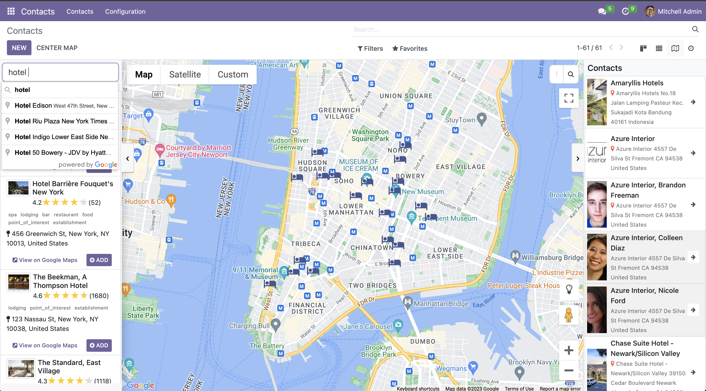
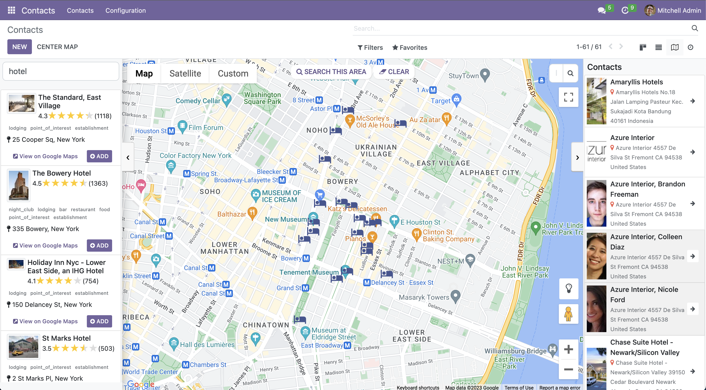
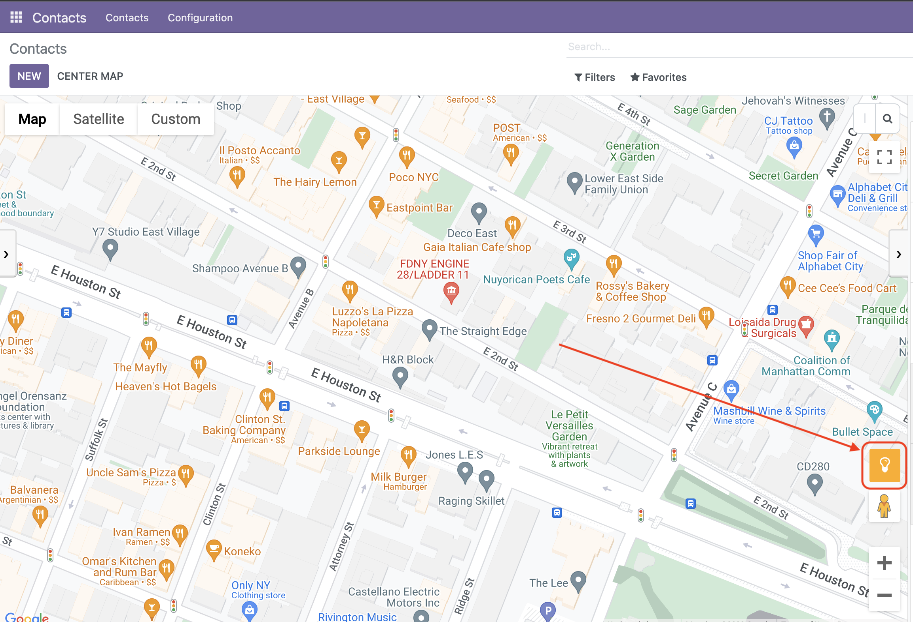

# Base Google Places
#### Base module to implement Google Places   


This module is designed to be flexible enough to be used in any custom module.    
Contains one Abstract Model `google.places.mixin` and a concrete model `google.places.types`

1. Abstract model `google.places.mixin`    
The idea was to store information of a place and store in Odoo.    
    ```python
    gplace_formatted_address = fields.Char(string='Google Address')
    gplace_id = fields.Char(string='Place ID', help='A textual identifier that uniquely identifies a place')
    gplace_url = fields.Char(string='Place URL')
    gplace_opening_hours = fields.Text(string='Opening Hours')
    gplace_type_ids = fields.Many2many(comodel_name='google.places.type', column1='address_id', column2='place_type', string='Types')
    gplace_plus_code_global = fields.Char(string='Global Code')
    gplace_plus_code_compound = fields.Char(string='Compound Code')
    gplace_plus_code_url = fields.Char(compute='compute_gplace_plus_url', string='Plus code URL')
    gplace_vicinity = fields.Char(string='Vicinity', help='A simplified address for the place, including the street name, street number, and locality, but not the province/state, postal code, or country')
    gplace_photos_url = fields.Text(string='Photos')
    ```

2. Concrete model `google.places.types`    
A model to manage Google Places Types    
Reference: https://developers.google.com/maps/documentation/places/web-service/supported_types#table1


### Steps to implement
1. Model   
    Inherit the abstract model `"google.places.mixin"`   
    example:
    ```python
    class MyModel(models.Model):
        _name = 'my.model'
        _inherit = ['google.places.mixin']
    ```
    or in the inheritance model of standard model
    ```python
    class ResPartner(models.Model):
        _name = 'res.partner'
        _inherit = ['res.partner', 'google.places.mixin']
    ```
2. Views    
   Create `google_map` view and give it an attribute `js_class` with value `google_map_places`
   example: 
   ```xml
   <!-- view -->
   <record id="view_my_model_google_map" model="ir.ui.view">
        <field name="name">view.my.model.google_map</field>
        <field name="model">my.model</field>
        <field name="arch" type="xml">
            <google_map string="Google Maps" lat="latitude" lng="longitude" js_class="google_map_places" sidebar_title="name" sidebar_subtitle="address">
                <field name="name"/>
                <field name="address"/>
                <field name="latitude"/>
                <field name="longitude"/>
        </field>
   </record>
   <!-- action -->
   <record id="action_menu_my_model" model="ir.actions.act_window">
        <field name="name">Google Map</field>
        <field name="res_model">my.model</field>
        <field name="view_mode">tree,google_map,form</field>
        ...
   </record>
   ```

### Features    
1. Google Place Search    
Using Place Autocomplete helps you find any places such Office building, Pharmacy, Restaurant, etc. And store the data in Odoo   

    
2. Google Place Nearby Search    
You can search any places within certain area    

    

3. Register any place or location on map    
Click any location on map and then store it in Odoo    

    


### Implementation
For implementation, please have a look on the module `contacts_google_places` and module `crm_google_places`

### References
- https://developers.google.com/maps/documentation/places/web-service/autocomplete
- https://developers.google.com/maps/documentation/places/web-service/place-data-fields  
- https://developers.google.com/maps/documentation/places/web-service/details