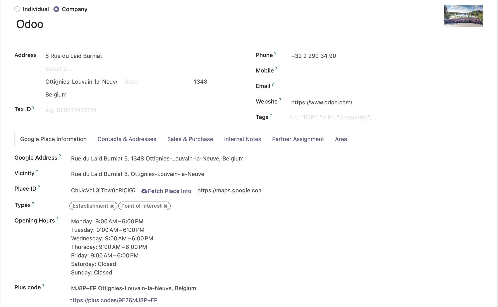

# Contacts Google Autocomplete Address Form Extended
#### An extended feature of the `gplaces_address_autocomplete` widget defined on module Contacts Google Autocomplete Address Form (contacts_gautocomplete_address_form)    

The implementation of a new widget `gplaces_address_autocomplete_extend` from module `web_widget_google_places`    

Automatically fulfill Google Places Information any time you select a place from the dropdown (`gplaces_address_autocomplete`)

