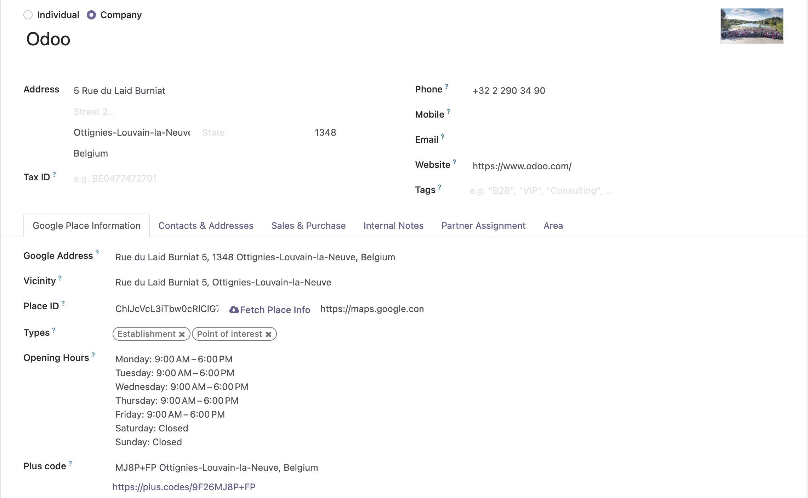

# Contacts Google Places Autocomplete Extended
#### An extended feature of the `gplaces_autocomplete_extended` widget defined on module Contacts Google Places Autocomplete(contacts_gautocomplete_places)    

The implementation of a new widget `gplaces_autocomplete_extended` from module `web_widget_google_places`    

Automatically fulfill Google Places Information any time you select a place from the dropdown (`gplaces_address_autocomplete`)

