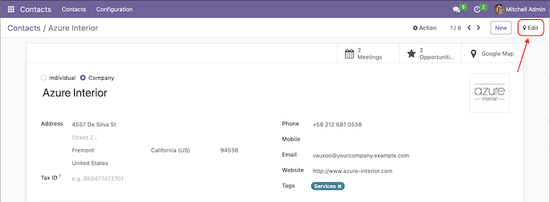

# Change Log
## 16.0.4.1.3
- Fixed marker info window issue in marker cluster. When marker info window inside a cluster is open and leave it open and then move to another cluster, instead of showing the markers inside the cluster, the map will pan to (go back to) the previous marker opened.

## 16.0.4.1.2
- Improved marker info window
- Added new map theme 'Blueprint'
- Added a new Abstract class `google.map.view.mixins`. This class design to provide mixins to the `google_map` view

## 16.0.4.0.2
- google_map_x2many_field bug fixes

## 16.0.4.0.1
- Bug fixes and improvement

## 16.0.4.0.0
- Support selection.
    - Added the ability to select marker(s) in the view and trigger an action. You can select markers by using the checkbox in the map sidebar or by holding the 'Shift' key and clicking on the desired markers.    
      Note: Existing actions need to be modified to make them visible in the view, or new actions need to be created to be accessible in the view.    
      Example:    
      In the contacts "list" view, there is an action called "Send email" defined as shown in the code snippet below.
      ```xml
      <record id="action_partner_mass_mail" model="ir.actions.act_window">
            <field name="name">Send email</field>
            <field name="res_model">mail.compose.message</field>
            <field name="view_mode">form</field>
            <field name="target">new</field>
            <field name="context" eval="{
                'default_composition_mode': 'mass_mail',
                'default_partner_to': '{{ object.id or \'\' }}',
                'default_use_template': False,
                'default_reply_to_force_new': True,
            }"/>
            <field name="binding_model_id" ref="base.model_res_partner"/>
            <field name="binding_view_types">list</field>
        </record>
      ```
      In order to make the action visible in the `"google_map"` view. One need to modify by add `"google_map"` to the property `"binding_view_types"` like so
      ```xml
      <record ...>
        <field name="binding_view_types">list,google_map</field>
      </record>
      ```
      or if you want to make it visible only to `"google_map"` view
      ```xml
      <record ...>
        <field name="binding_view_types">google_map</field>
      </record>
      ``` 
- Support dark mode.
- Support export.
- Added a geolocate button.    
Button to pin-point current location in the map

## 16.0.3.2.2
### Added
## "Edit Geolocation" on form view    
    
New subview of form view `"google_map_form"`. This subview is designed specifically to edit geolocation fields (latitude and longitude).    
To activate the button, there are four new attributes:    
  1. `"edit_lat_lng"`    
     An attribute to show the button
  2. `"google_map_form_view_ref"` (optional)    
     An attribute to tell Odoo which view to render. If you have multiple views for `"google_map_form"` (should be a rare case), this attribute would be very helpful.
  3. `"lat"`    
     An attribute to let the view know the latitude field
  4. `"lng"`    
     An attribute to let the view know the longitude field

  Example:    
  ```xml
    <!-- google_map form view -->
    <record id="view_my_google_map_form" model="ir.ui.view">
        <field name="name">view.my.google.map.form</field>
        <field name="model">res.partner</field>
        <field name="arch" type="xml">
            <form js_class="google_map_form" string="Contact" lat="partner_latitude" lng="partner_longitude">
                <field name="partner_latitude"/>
                <field name="partner_longitude"/>
            </form>
        </field>
    </record>

    <!-- the form view -->
    <!-- On the main form view, there are two new custom attributes: `edit_lat_lng` and `google_map_form_view_ref` -->
    <!-- `edit_lat_lng`: attribute to activate the Edit button (a new one to modify geolocation fields) -->
    <!-- `google_map_form_view_ref`: optional attribute, to specify which google_map form view to render -->
    <recod id="view_my_form" model="ir.ui.view">
        <field name="name">view.my.form</field>
        <field name="model">res.partner</field>
        <field name="arch" type="xml">
            <form string="My Form" edit_lat_lng="1" google_map_form_view_ref="my_module.view_my_google_map_form">
                ...
            </form>
        </field>
    </record>
  ```
  Note:    
  For form `js_class="google_map_form"`, please create a dedicated form view instead. At the end, there will be two form view. One for the main form view and the other is for the google_map.

### Changed
### Fixed


## [16.0.2.2.2] -- 22/08/2023
### Added
- FontAwesome icon as marker    
Check this url https://fontawesome.com/v6/search?o=r&m=free&s=solid for available icon that can be used.
- Two new optional attributes `"marker_icon"` and `"icon_scale"`    
  - `marker_icon`    
  An attribute to assign FontAwesome icon to marker(s) rendered on the `google_map` view. Default icon is `"location-dot"` https://fontawesome.com/icons/location-dot?f=classic&s=solid    
  Use the FontAwesome icon name without prefix `"fa"` for example, icon `"fa-flag"` (https://fontawesome.com/icons/flag?f=classic&s=solid) then in the `"marker_icon"` attribute just use `"flag"`.    
    Example:    
    ```xml
    <google_map marker_icon="flag">
      ...
    </google_map>
    ```
  - `icon_scale`    
  An attribute to set the scale of the FontAwesome icon. Default value is `1`.    
    Example:    
    ```xml
    <google_map icon_scale="0.8">
      ...
    </google_map>
    ```
### Changed
### Fixed

## [16.0.1.2.2] -- 19/07/2023
### Added

### Changed

### Fixed
 - The Google search input placed inside the map becomes transparent.

## [16.0.1.2.1] -- 12/05/2023
### Added
### Changed
### Fixed
* Bug fixes and improvement
  - Add loading window
  - Improved reactivity of the view `"google_map"` and it's sub-view

## [16.0.1.1.1] -- 12/04/2023
### Added

### Changed
- Clicked the button "Open" on the marker info window will open form view in a dialog, before it's switched to form view page.

### Fixed
- Google maps and the markers are not processed until the Google loader is fully loaded
- Unfold/fold sidebar no longer reset the center of the map
- Fixed reactivity issue of component `GoogleMapSidebar`
- Remove unused props