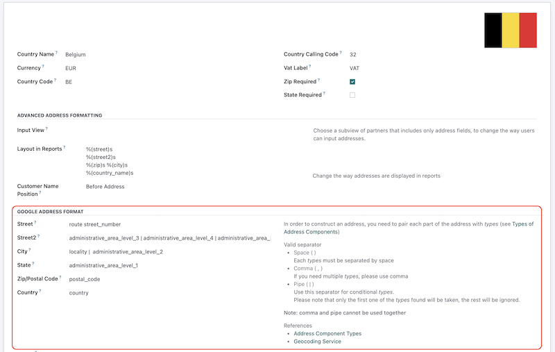

# Web Widget Google Maps

## There are two widgets:
- `gplaces_autocomplete`
- `gplaces_address_autocomplete`

## New setting added on res.country    
A setting to construct an address returned by Google Services (service used by the two new widgets)



### 1. Widget `gplaces_autocomplete`
This widget uses Google places autocomplete API [https://developers.google.com/maps/documentation/javascript/examples/places-autocomplete](https://developers.google.com/maps/documentation/javascript/examples/places-autocomplete)

How to use?    
Example:
```xml
<field name="name" widget="gplaces_autocomplete" options="{'fillfields': {
    'geolocation': {
        'lat': 'partner_latitude',
        'lng': 'partner_longitude'
    }
}}"/>
```

Available option `fillfields` that you can customize:
```javascript
{
    general: {
        ODOO_FIELD: [GOOGLE_PLACES_FIELDS],
        ...
    },
    address: {
        street: ODOO_FIELD,
        street2: ODOO_FIELD,
        city: ODOO_FIELD,
        zip: ODOO_FIELD,
        state_id: ODOO_FIELD,
        country_id: ODOO_FIELD,
    },
    geolocation: {
        lat: [GOOGLE_PLACES_FIELDS]
        lng: [GOOGLE_PLACES_FIELDS]
    },
}
```
`ODOO_FIELD`: model field.    
`GOOGLE_PLACES_FIELDS`: Google autocomplete component form (address section) and Google places field name (general section), and Google geocode (geolocation section), you can assigned multiple values

The option are devided into three sections:
- `general`    
This option is to represent fields: `name`, `website`, and `phone` in your model.    
On the left side is where you define Odoo field name.    
On the right side is Google places field name.    
- `address`    
Behave like `general`, this section is where you define your address fields of your model
- `geolocation`    
Same as `general` and `address`, this section is for the fields that represent geolocation (latitude and longitude) in your model.


Example:
```javascript
{
    general: {
        name: 'name',
        website: 'website',
        phone: ['international_phone_number', 'formatted_phone_number'],
    },
    // address fields in res.partner model
    address: {
        street: 'street',
        street2: 'street2',
        city: 'city',
        zip: 'zip',
        state_id: 'state_id',
        country_id: 'country_id',
    },
    // geolocation fields in res.partner model
    geolocation: {
        lat: 'partner_latitude',
        lng: 'partner_longitude',
    },
}
```


Notes:    
For options `fillfields`, the default values are 
```javascript
{
    general: {
        name: 'name',
        website: 'website',
        phone: ['international_phone_number', 'formatted_phone_number'],
    },
    address: {
        street: 'street',
        street2: 'street2',
        city: 'city',
        zip: 'zip',
        state_id: 'state_id',
        country_id: 'country_id',
    },
},
```
If "general" section and "address" section in your model defined like fields in `res.partner` model than no need to set it.    
Section "geolocation" is not define by default so you must set it manually.

### 2. Widget `gplaces_address_autocomplete`
This widget uses Google Autocomplete Address Form API [https://developers.google.com/maps/documentation/javascript/examples/places-autocomplete-addressform](https://developers.google.com/maps/documentation/javascript/examples/places-autocomplete-addressform)    


This widget works similar to the widget `gplaces_autocomplete`.

How to use?    
Example: 
```xml
<field name="name" widget="gplaces_address_autocomplete" options="{
    address_form: {
        street: 'street',
        street2: 'street2',
        city: 'city',
        zip: 'zip',
        state_id: 'state_id',
        country_id: 'country_id',
    },
    lat: 'partner_latitude',
    lng: 'partner_longitude',
}"/>
```

Available option `fillfields` that you can customize:
```javascript
{
    address_form: {
        street: ODOO_FIELD,
        street2: ODOO_FIELD,
        city: ODOO_FIELD,
        zip: ODOO_FIELD,
        state_id: ODOO_FIELD,
        country_id: ODOO_FIELD,
    },
    lat: ODOO_FIELD,
    lng: ODOO_FIELD 
}
```

Example:
```javascript
{
    address_form: {
        street: 'street',
        street2: 'street2',
        city: 'city',
        zip: 'zip',
        state_id: 'state_id',
        country_id: 'country_id',
    },
    lat: 'partner_latitude',
    lng: 'partner_longitude',
}
```

Notes:    
For options `address_form`, the default value are 
```javascript
{
    street: 'street',
    street2: 'street2',
    city: 'city',
    zip: 'zip',
    state_id: 'state_id',
    country_id: 'country_id',
},
```
If the address fields in your model are defined like the address fields in `res.partner` model than no need to set it.


Useful links:
- [https://developers.google.com/maps/documentation/javascript/place-data-fields](https://developers.google.com/maps/documentation/javascript/place-data-fields)
- [https://developers.google.com/maps/documentation/geocoding/requests-geocoding#Types](https://developers.google.com/maps/documentation/geocoding/requests-geocoding#Types)
- [https://developers.google.com/maps/documentation/javascript/examples/geocoding-simple](https://developers.google.com/maps/documentation/javascript/examples/geocoding-simple)

If you have any difficulties implementing or using this widget in your custom module, please do not hesitate to open an issue.